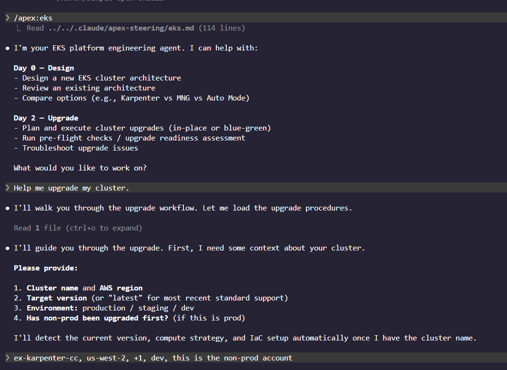
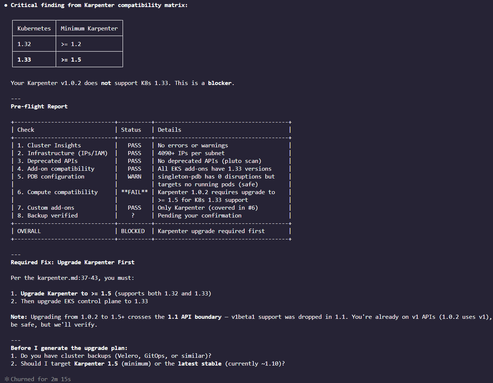
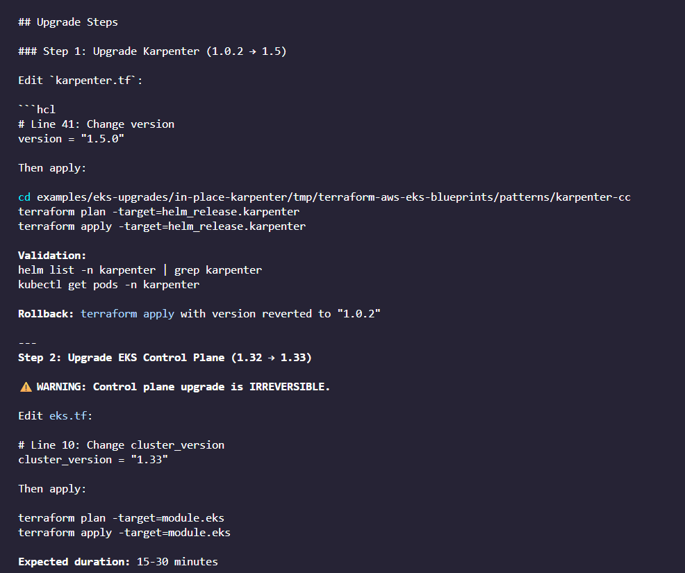
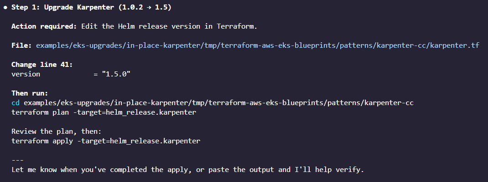
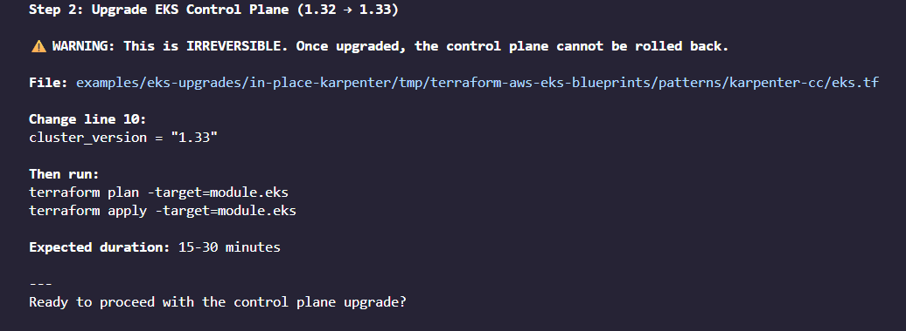
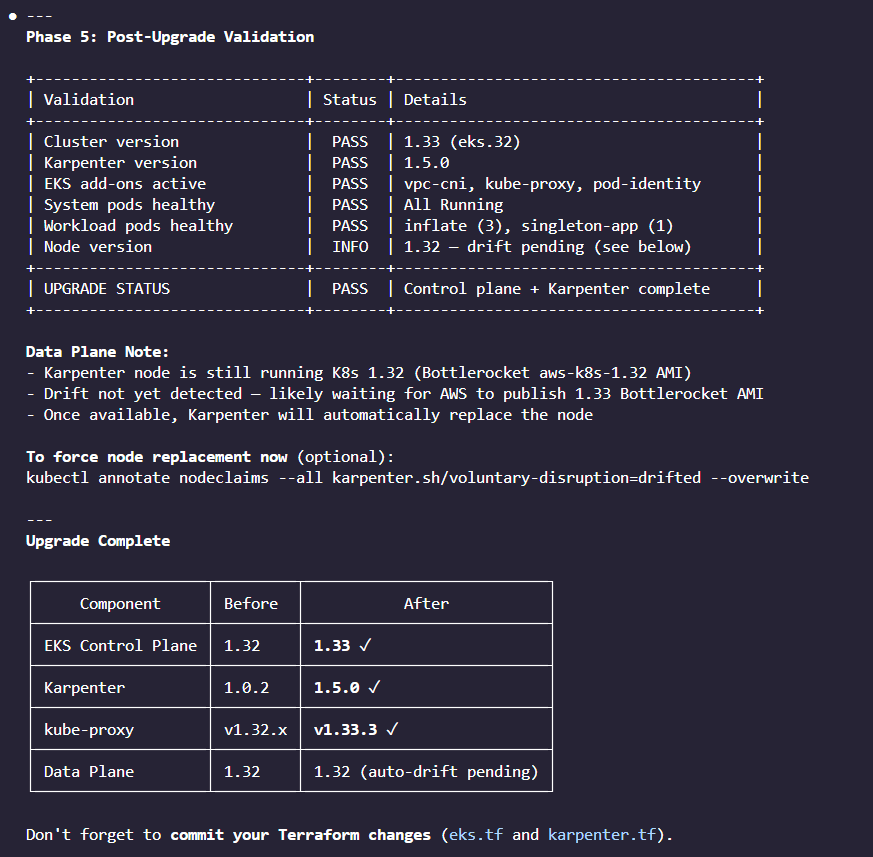
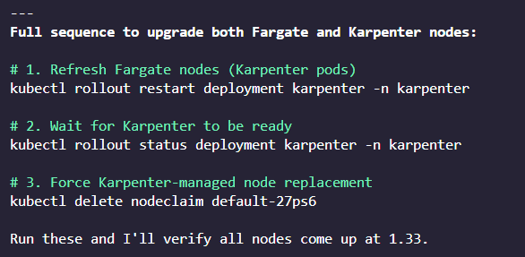
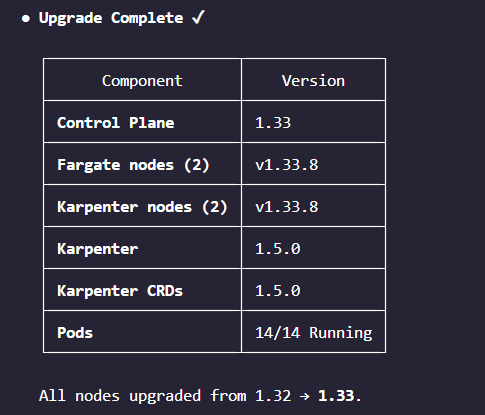

# Upgrade Your EKS Cluster In-Place with APEX EKS

A hands-on exercise that demonstrates the APEX EKS [Upgrade Workflow](../../../steering/workflows/upgrade.md) in practice. Deploy a cluster at EKS 1.32, plant realistic issues, and upgrade to 1.33 -- letting APEX catch and guide you through each problem.

The upgrade workflow uses the [`eks-upgrader`](../../../skills/eks-upgrader/SKILL.md) skill for upgrade procedures, compatibility matrices, and component-specific guidance (Karpenter, Istio, etc.), combined with [`eks-best-practices`](../../../skills/eks-best-practices/SKILL.md) for general cluster knowledge.

## Overview

```
EKS 1.32 → 1.33
   │          │
   │          └─ Endpoints API deprecated (favor EndpointSlices)
   │             AL2 AMI no longer published for new nodes
   │             Karpenter >= 1.5 required (deployed: v1.0.2)
   │
   └─ Starting point: deploy cluster here
```

## Prerequisites

- AWS account with EKS permissions
- Terraform >= 1.5.7
- kubectl
- AWS CLI v2
- One of:
  - [Claude Code](https://claude.ai/code)
  - [Kiro IDE](https://kiro.dev/downloads/) or [Kiro CLI](https://kiro.dev/docs/cli/installation/)

### Setup and Deploy

The deploy script handles everything: sets up APEX EKS for your chosen tool (Claude Code or Kiro), deploys the base EKS 1.32 cluster using the [Karpenter pattern](https://github.com/aws-ia/terraform-aws-eks-blueprints/tree/main/patterns/karpenter) from terraform-aws-eks-blueprints, and plants the upgrade issues.

**What it does:**

1. **APEX EKS setup** -- asks which tool you're using, then symlinks skills and commands for Claude Code (`.claude/skills/`, `.claude/commands/`) or Kiro (`.kiro/skills/`, `.kiro/steering/`)
2. **Deployment name** -- asks for a name (defaults to `cc` or `kiro`). The pattern is copied to `karpenter-<name>/`, giving cluster name `ex-karpenter-<name>`. This enables parallel deployments -- run deploy.sh twice with different names for side-by-side testing.
3. **Deploy base cluster** -- clones terraform-aws-eks-blueprints into `tmp/`, pins the cluster version to 1.32, runs `terraform init` and `terraform apply` on the Karpenter pattern, configures kubectl, then applies Karpenter resources and scales the inflate deployment to 3 replicas
4. **Plant issues** -- applies manifests that simulate real-world upgrade problems:

| # | Source | What it does | Version Impact |
|---|--------|-------------|----------------|
| 1 | `blocking-pdb.yaml` | Single-replica Deployment + PDB with `minAvailable: 1` | **Blocks upgrade** -- nodes can never be drained because evicting the only pod violates the PDB. Fix by scaling to >=2 replicas or using `maxUnavailable: 1`. |
| 2 | `endpoints-watcher.yaml` | RBAC granting watch on the `endpoints` API | **Deprecated in 1.33** -- the Endpoints API is deprecated in favor of EndpointSlices (`discovery.k8s.io/v1`). Still works but emits warnings; will be removed in a future version. |
| 3 | `karpenter.tf` (Helm chart version) | Karpenter deployed at v1.0.2 via Terraform | **Blocks upgrade** -- K8s 1.33 requires Karpenter >= 1.5 per the [compatibility matrix](https://karpenter.sh/docs/upgrading/compatibility/). Upgrading the control plane without upgrading Karpenter first will break node provisioning. Fix by updating the Helm chart version in `karpenter.tf` to >= 1.5 and running `terraform apply` before the control plane upgrade. |

Run from this directory (`examples/eks-upgrades/in-place-karpenter/`):

```bash
chmod +x ./scripts/deploy.sh
./scripts/deploy.sh
```

> **Note:** You might have to redeploy Fargate pods if they are not up after the initial deploy.

## Upgrade with APEX EKS

Now use the APEX EKS upgrade workflow. The workflow loads the [`eks-upgrader`](../../../skills/eks-upgrader/SKILL.md) skill for step-by-step upgrade procedures and the [`eks-best-practices`](../../../skills/eks-best-practices/SKILL.md) skill for cluster knowledge.

<details>
<summary><strong>Claude Code</strong></summary>

Open Claude Code in Repo Root (so that Claude does not read this README):

```bash
cd ../../..
claude
```

Then use the slash command:

```
/apex:eks
```

Or Directly:

```
/apex:eks-upgrade
```

Or just say: **"Upgrade my cluster from 1.32 to 1.33"**

</details>

<details>
<summary><strong>Kiro CLI</strong></summary>

```bash
cd ../../..
kiro-cli chat
```

```bash
/model claude-opus-4.5
```

```bash
/context add ../../../steering/eks.md
```

Then say: **"Upgrade my cluster from 1.32 to 1.33"**

</details>

## Expected Outcome

By the end of this exercise, you should have:

1. **Experienced the upgrade workflow** -- APEX walks through pre-flight -> plan -> execute -> validate
2. **Seen real issues detected** -- deprecated APIs, incompatible add-ons, blocking PDBs, missing backups
3. **Fixed issues with guidance** -- APEX provides remediation steps for each finding
4. **Successfully upgraded 1.32 -> 1.33** -- a single in-place upgrade with validation at each step  

## Test  

Just a few screenshots from one round of testing (Claude Code + Opus 4.5):  

1. Phase 1: Understanding the context  
  
  

2. Phase 2: Pre-Flight Checklist  
  
  

3. Phase 3: Upgrade Plan (Just the first 2 steps shown here)  
  
  

4. Phase 4: Upgrade Companion  
  
  
  
  
    
  

5. Phase 5: Post-Upgrade Validation  
  
  

6. Just for fun, getting it to upgrade karpenter and fargate now:  
  
  

**Completed**  
  


## Cleanup

The destroy script auto-discovers active deployments under `tmp/`. If multiple exist, it asks which one to destroy (or all). It then deletes planted manifests, terminates all Karpenter-provisioned EC2 instances (crucial -- must happen before Terraform destroy or it will hang on VPC/subnet/security group deletion), waits for instances to terminate, runs `terraform destroy`, and cleans up the deployment directory.

```bash
chmod +x ./scripts/destroy.sh
./scripts/destroy.sh
```

## Further Reading

- [APEX EKS Upgrade Workflow](../../../steering/workflows/upgrade.md)
- [EKS Upgrader Skill](../../../skills/eks-upgrader/SKILL.md)
  - [In-Place Upgrade Reference](../../../skills/eks-upgrader/references/in-place-upgrade.md)
  - [Karpenter Upgrade Reference](../../../skills/eks-upgrader/references/karpenter.md)
  - [Blue-Green Upgrade Reference](../../../skills/eks-upgrader/references/blue-green-upgrade.md)
- [EKS Best Practices -- Cluster Upgrades](../../../skills/eks-best-practices/references/cluster-upgrades.md)
- [EKS Version Release Notes -- Standard Support](https://docs.aws.amazon.com/eks/latest/userguide/kubernetes-versions-standard.html)
- [EKS Version Release Notes -- Extended Support](https://docs.aws.amazon.com/eks/latest/userguide/kubernetes-versions-extended.html)
